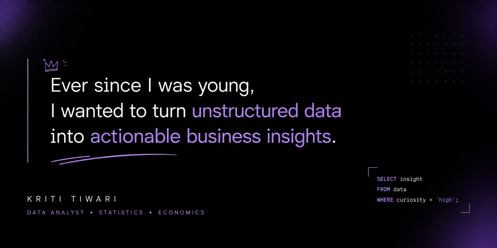

  

<h1 align="center"> Kriti Tiwari</h1>

<h3 align="center">
Statistics Graduate | Data Science & Analytics | Business Intelligence
</h3>

Turning data into actionable business insights through analytics, statistics, and storytelling.

<a href="mailto:tiwarikriti2607@gmail.com">Email</a> •
<a href="https://www.linkedin.com/in/kritiwari">LinkedIn</a>

<h2>👩‍💻 About Me</h2>

My work sits at the intersection of analytics, statistics, and business strategy.

I enjoy transforming messy datasets into clear narratives, identifying patterns hidden beneath numbers, and building solutions that help organizations make better decisions.

Through projects spanning consumer intelligence, risk analysis, forecasting, and business dashboards, I've developed a strong foundation in translating data into action.

<h2>💻 Tech Stack</h2>

<ul>
<li>SQL</li>
<li>Python</li>
<li>Pandas</li>
<li>NumPy</li>
<li>Power BI</li>
<li>Excel</li>
<li>Git</li>
<li>GitHub</li>
</ul>
